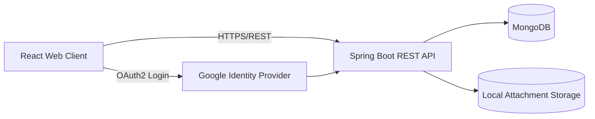
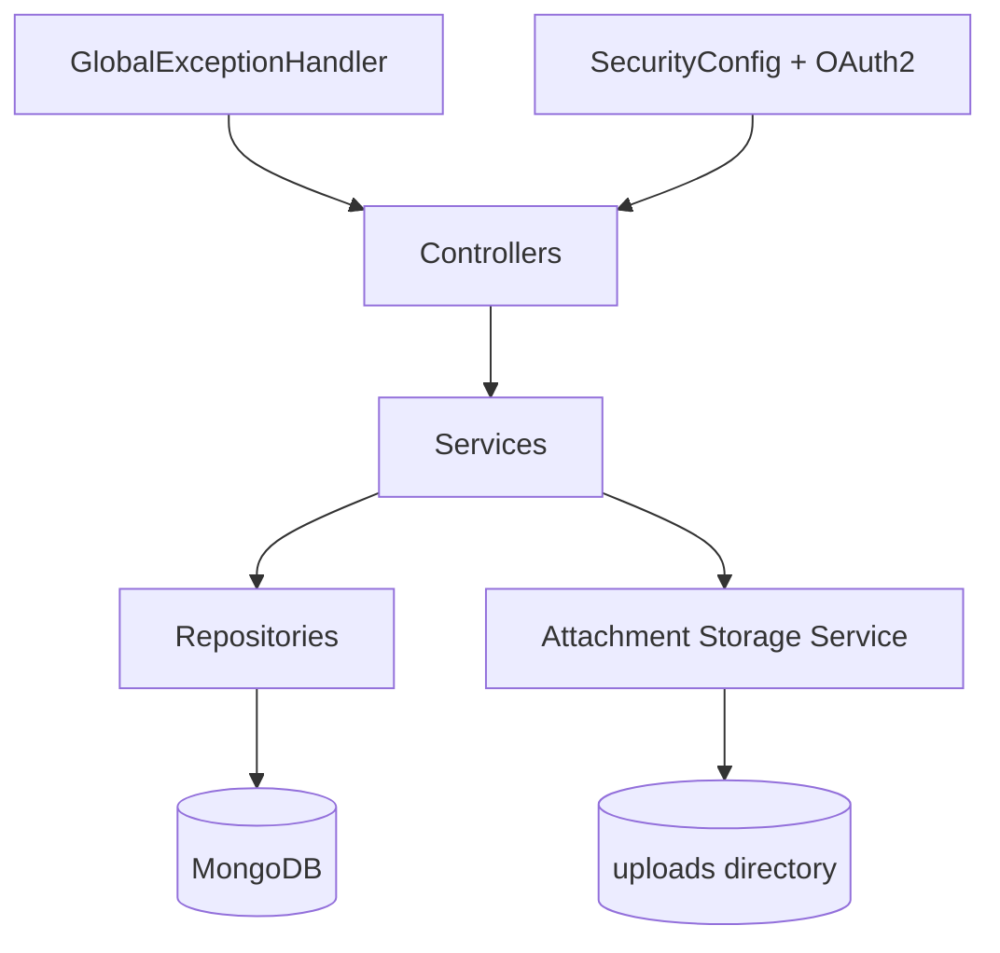
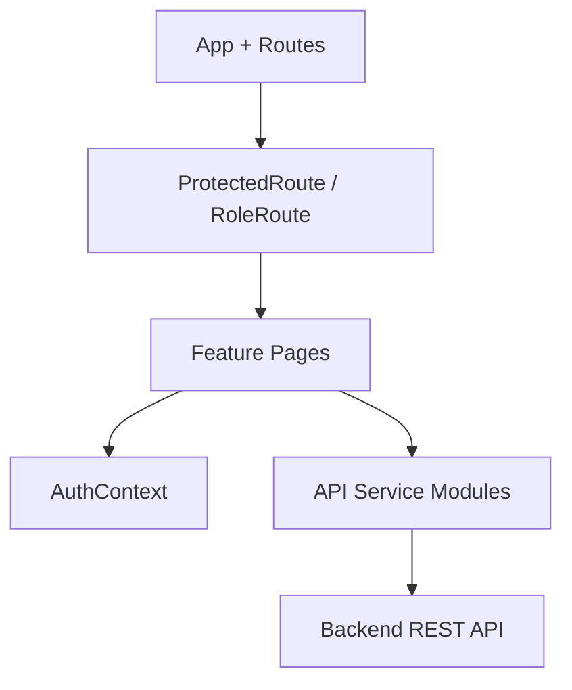

# Smart Campus Operations Hub

## Functional Requirements

### Module A - Facilities and Assets Catalogue
- Maintain resources with type, capacity, location, availability window, and status.
- Search and filter resources by type, capacity range, location, and status.
- Admin users can create, update, and delete resources.

### Module B - Booking Management
- Authenticated users can submit booking requests with date, time range, purpose, and expected attendees.
- Booking workflow supports PENDING, APPROVED, REJECTED, and CANCELLED states.
- Scheduling conflict prevention blocks overlapping bookings for the same resource and date.
- Admin users can approve or reject with a reason and can cancel bookings.
- Users can view their own bookings and admin users can view all with filters.

### Module C - Ticketing and Maintenance
- Authenticated users can create tickets with category, description, priority, and contact details.
- Tickets support OPEN, IN_PROGRESS, RESOLVED, CLOSED, and REJECTED states.
- Ticket attachments support up to 3 images with secure file validation and storage.
- Admin and technician roles can update status, assignee, and resolution notes.
- Comment workflow allows create, update own, and delete own operations.

### Module D - Notifications
- Users receive notifications for booking decisions.
- Users receive notifications for ticket status updates.
- Users receive notifications for new comments.
- Notification panel supports list and mark-as-read actions.

### Module E - Authentication and Authorization
- OAuth2 Google login.
- Role model includes USER, ADMIN, TECHNICIAN.
- API access control is role-aware and route protection is enforced in frontend.

## Non-Functional Requirements
- Security: OAuth2 authentication, role-based authorization, central exception handling, input validation, safe attachment constraints.
- Usability: clear route separation for user/admin workflows and explicit feedback on errors.
- Maintainability: layered architecture (controller-service-repository), isolated API services in frontend.
- Scalability: stateless REST API with MongoDB persistence and filterable list endpoints.
- Reliability: CI workflow builds and validates backend and frontend on pushes and pull requests.

## High-Level Architecture

## Backend Architecture

## Frontend Architecture

## Testing and Quality Evidence
- Backend unit test: Booking conflict logic in `BookingServiceTest`.
- Backend unit test: Ticket workflow transition logic in `TicketServiceTest`.
- Backend compile and verification through Maven.
- Frontend production build through Vite.
- Centralized exception handling with structured payload (`timestamp`, `status`, `error`, `message`, `path`, `details`).

## Additional Submission Artifacts
- Endpoint inventory: `docs/endpoint-inventory.md`
- Testing checklist and evidence guide: `docs/testing-evidence.md`
- Team contribution matrix: `docs/contribution-matrix.md`
- Report source draft: `docs/IT3030_PAF_Assignment_2026_GroupXX_report.md`

## CI/CD
- GitHub Actions workflow runs backend verify and frontend build on push and pull request.
